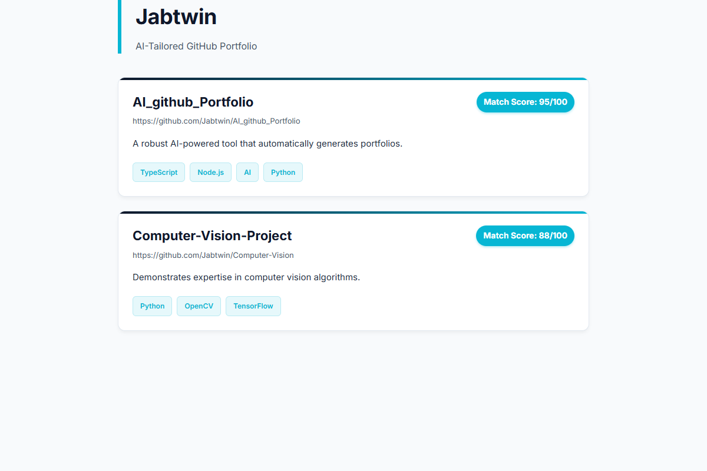

# AI-Tailored GitHub Portfolio Generator 🚀

> **Short Description (For GitHub About section):**
> An intelligent desktop application that uses Gemini AI and the GitHub API to generate a personalized, professional PDF portfolio perfectly tailored to any Job Description.

An intelligent, fully automated desktop application that generates a highly professional, PDF-formatted GitHub portfolio tailored specifically to any Job Description (JD). 

By leveraging the power of **Google Gemini 2.5 Flash** and the **GitHub API**, this tool analyzes your repositories, matches them against the skills required in a JD, and crafts customized summaries that highlight exactly why you are the perfect fit for the job!

## 📸 Preview


## ✨ Features
- **Intelligent Relevance Engine**: AI automatically scores and ranks your GitHub repositories based on the provided Job Description.
- **Tailored Summaries**: Generates a custom 2-sentence summary for each selected project to highlight relevant skills.
- **Beautiful PDF Export**: Uses Handlebars and Puppeteer to render a stunning "Tech/Robotics" themed PDF portfolio.
- **Native Desktop GUI**: A clean, easy-to-use Python Tkinter interface. No web server or complicated CLI commands required!
- **Secure**: API keys are passed securely into the environment at runtime and are never hardcoded.

## 🛠️ Technology Stack
- **Backend Core**: TypeScript, Node.js
- **AI Integration**: `@google/generative-ai` (Gemini 2.5 Flash)
- **GitHub Integration**: `@octokit/rest`
- **PDF Generation**: `puppeteer`, `handlebars`
- **Desktop UI**: Python 3 (`tkinter`)

## 🚀 Getting Started

### Prerequisites
1. **Node.js** (v18 or higher)
2. **Python 3.x**
3. **GitHub Personal Access Token**: Needs `repo` read access.
4. **Google Gemini API Key**

### Installation

1. **Clone the repository:**
   ```bash
   git clone https://github.com/Jabtwin/Al_github_Portfolio.git
   cd Al_github_Portfolio
   ```

2. **Install Node dependencies:**
   ```bash
   npm install
   ```

3. **Compile TypeScript:**
   ```bash
   npm run build
   ```

### Usage
1. Simply double-click the `run.bat` file (or run `python app.py` in your terminal).
2. The Desktop GUI will appear.
3. Enter your **GitHub Username**, **GitHub Token**, and **Gemini API Key**.
4. Paste the **Job Description** you are applying for.
5. Click **Generate PDF**!
6. In a few seconds, the tailored PDF portfolio will automatically open on your screen.

## 📝 License
This project is licensed under the MIT License.
